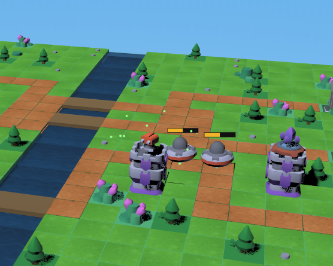
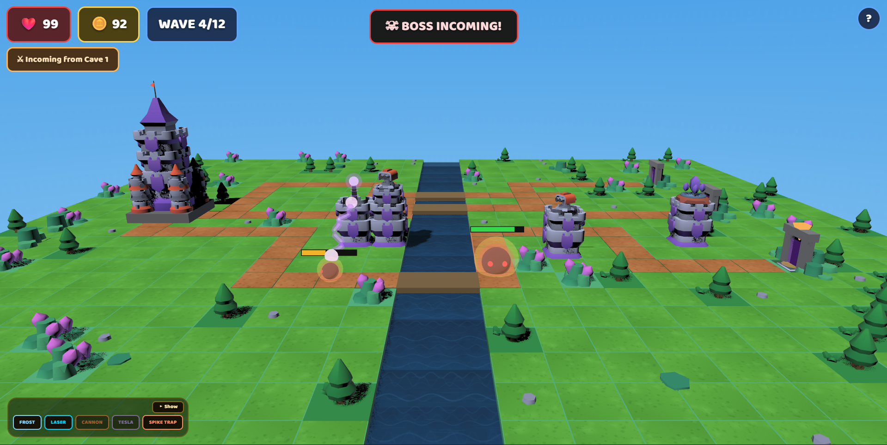
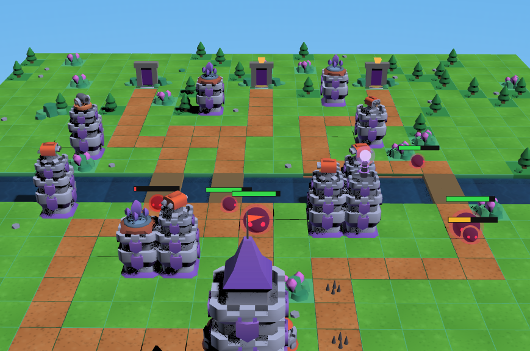

# Void Rush

A 3D tower defense game built with the [Kenney Tower Defense Kit](https://kenney.nl/) assets, implemented twice against the same game data with two different rendering engines.





## Builds

This repo contains two parallel, self-contained implementations of the same game:

| Folder | Engine | Status |
| --- | --- | --- |
| [`babylon3d/`](babylon3d/) | [Babylon.js](https://www.babylonjs.com/) | Primary / most complete build |
| [`pixi3d/`](pixi3d/) | [PixiJS](https://pixijs.com/) + [pixi3d](https://github.com/jnsmalm/pixi3d) | Same GLB models & game data, custom GLB loader |

Both share the same map layout, waves, towers, and enemy data, just rendered through different 3D pipelines.

## Gameplay

Place towers along the paths to stop waves of enemies from reaching your castle. Earn gold by defeating enemies, upgrade tower branches, and survive escalating waves — including boss waves — across multiple difficulties.

- Multiple tower types: Frost, Laser, Cannon, Tesla, Spike Trap
- Branching tower upgrades
- Wave-based enemy spawns with boss encounters
- Gold economy and base HP
- Kenney Tower Defense Kit 3D models and textures

## Running locally

Each build is an independent Vite project.

```bash
cd babylon3d      # or pixi3d
npm install
npm run dev
```

Then open the printed local URL in your browser.

### Build for production

```bash
npm run build
npm run preview
```

## Project structure

```
voidwatch/
├── babylon3d/              # Babylon.js build
│   ├── src/game3d/
│   │   ├── boot.js         # engine, scene, camera, lights, game loop
│   │   ├── data.js         # map layout, towers, enemies, waves, difficulties
│   │   └── sfx.js          # audio
│   └── public/              # models, textures, kenney assets
├── pixi3d/                  # PixiJS + pixi3d build
│   ├── src/game/
│   └── public/
└── kenney_tower-defense-kit/ # source art assets
```

## Assets

3D models and textures come from the [Kenney Tower Defense Kit](https://kenney.nl/assets/tower-defense-kit), used under Kenney's CC0 license.
